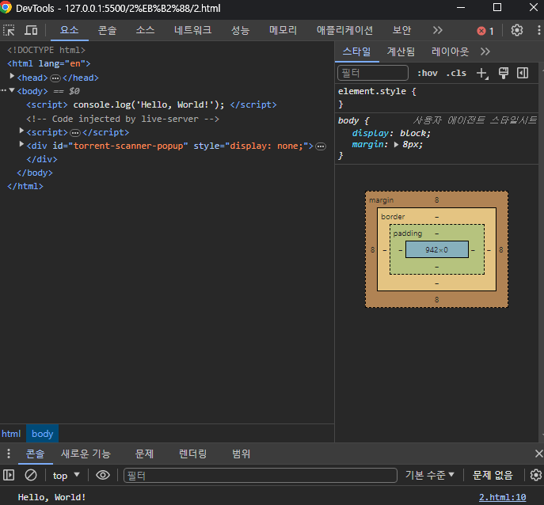

### console.log와 return의 차이가 무엇인가요?

(여기에 작성)

-console.log

브라우저의 개발자도구(F12)에서 콘솔창에 보여줘서 기능이 제대로 작동하는지 확인하는 용도.

> ex)
> 

```
console.log("Hello World!");
```

-return

함수에서 만든 값을 해당 return 이 나온 함수 밖에서도 사용하기 위한 용도.

> ex)

```
function hello() {
  return 'Hello, World!';
}

console.log(hello());
hello();
```
